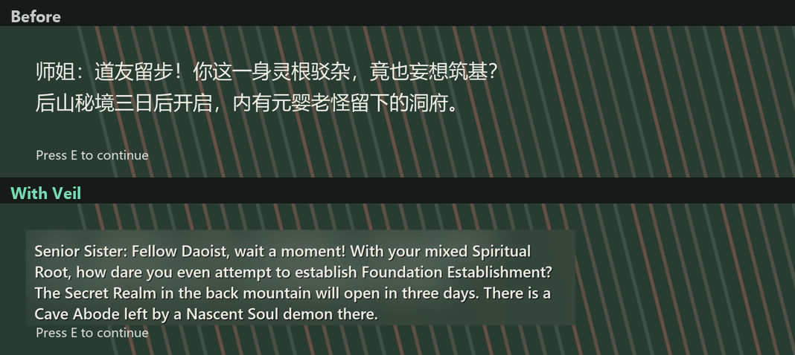

# Lacyan Translator

**Live on-screen translation for games and apps, running entirely on your own PC.**

Lacyan Translator watches your screen, finds Chinese text, translates it with a local AI model, and paints the
translation right where the original was, over a soft blur that hides the original text. Nothing is
injected into the game, nothing is sent to the cloud, and there's nothing to configure: start it and play.



## Why another screen translator?

Most OCR translators make you draw a box, show results in a separate window, and re-translate the
same menu labels over and over. Lacyan Translator is built around three ideas:

- **It finds the text for you.** The whole window is scanned on the GPU. Lines that belong together
  are merged into blocks, a block grows as more text appears, and text that's still "typing out"
  isn't translated until it settles.
- **The translation replaces the original.** Each block gets a feathered blur of the scene behind it,
  the original text colour is kept when it's readable, and boxes grow to fit longer English without
  covering other text on screen.
- **It moves with the screen.** Translations follow scrolling text frame by frame, vanish the instant
  their text is covered by a popup or replaced, and come back the moment it reappears.
- **It's always readable.** Every translation gets a solid outline and soft shadow, keeping the game's
  own text colour when that colour stands out.
- **It remembers.** Every translation is stored in a local translation memory, so repeated text
  (menus, item names, common lines) appears instantly, even when the OCR misreads a character.

## Quick start

1. Install [Ollama](https://ollama.com) and leave it running.
2. Install Python 3.10 or newer from [python.org](https://www.python.org/downloads/).
3. Download this repository and double-click **`LacyanTranslator.bat`**.

The first launch sets up everything (a few minutes): Python packages, the right GPU runtime for your
graphics card, and the translation model (Tencent Hunyuan-MT 1.5, 1.8B, about 1.9 GB). After that,
`LacyanTranslator.bat` starts in a couple of seconds, and starts Ollama for you if it isn't running.

Each launch opens a small window: pick the language to translate **to** (English by default), choose
the active window or the whole screen, and press **Start translating**.

Run your game in **windowed** or **borderless** mode. Exclusive fullscreen can hide overlays.

## Using it

Lacyan Translator lives in the system tray (the green **译** icon). Click it to change languages or
options while it runs.

| Hotkey | Action |
| --- | --- |
| `Alt+T` | Show the original text / show translations |
| `Alt+P` | Pause / resume |
| `Ctrl+Alt+Q` | Quit |

The tray menu lets you change the target language, switch between translating the **active window**
or the **whole screen**, open the settings file, and clear the translation memory.

Target languages: English, Filipino, Indonesian, Japanese, Korean, Vietnamese, Thai, Malay, Spanish,
Portuguese, French, German, Italian, Russian, Arabic, Turkish, Hindi, Traditional Chinese.

## Glossaries and phrasebooks

- **Glossaries** (`glossaries/xianxia.txt`): terms the model must translate a specific way, such as
  `筑基 = Foundation Establishment`. Only terms that actually appear in a line are sent with it.
- **Phrasebooks** (`glossaries/ui.txt`): exact matches that skip the model entirely. Short menu words
  are where machine translation guesses wrong (`确定` is "OK", not "Confirmed").

One `source = translation` pair per line. Add your own files in `config.json`.

## Settings

`config.json` is created next to `LacyanTranslator.bat` on first run. The most useful settings:

| Setting | Default | What it does |
| --- | --- | --- |
| `target_language` | `English` | Language to translate into |
| `endpoint`, `model`, `api_key` | local Ollama, `lacyan-mt` | Any OpenAI-compatible server works: LM Studio, llama.cpp, or a cloud API |
| `capture` | `foreground` | `foreground` = the active window, `monitor` = the whole screen |
| `font_family` | `Segoe UI` | Font for translations |
| `blur_strength`, `backdrop_tint` | `1.0`, `0.35` | How strongly the original is hidden |
| `keep_original_color` | `true` | Reuse the game's text colour when it's readable |
| `max_grow` | `1.8` | How much a block may grow to fit a longer translation |
| `hide_from_capture` | `true` | Keep the overlay out of screenshots and recordings (this is also how Lacyan Translator avoids reading its own output) |

## How it works

```
screen capture ─▶ change detection ─▶ GPU OCR ─▶ block grouping ─▶ tracking ─▶ translation memory ─▶ local model
                                                                                        │
                        click-through overlay ◀── blur + fitted text ◀──────────────────┘
```

- **Capture**: `mss`, 30 frames a second while translations are shown (10 when idle), of the active
  window. The overlay window is excluded from capture (`WDA_EXCLUDEFROMCAPTURE`), so Lacyan Translator
  always sees the real game underneath.
- **Following**: every frame, each shown translation checks that its text is still there with a small
  normalized-correlation match (about 3 ms for the whole frame). Moved text is found again nearby, with
  the scroll speed used to predict where it went; text that's gone hides on the same frame.
- **OCR**: PP-OCRv4 through RapidOCR on ONNX Runtime (CUDA on NVIDIA, DirectML on other GPUs, CPU as
  a last resort), on its own thread so following never waits for it. Text boxes are detected on the full frame, but only boxes in the area that changed
  are read again; everything else reuses the previous reading.
- **Grouping and tracking**: OCR lines are merged into paragraphs, matched across frames so the
  overlay doesn't flicker, and translated only once their text has been stable for two passes.
- **Translation**: Hunyuan-MT 1.5 (1.8B) through Ollama, using the model's own prompt format and
  glossary syntax, with a retry when a line comes back untranslated.
- **Rendering**: a click-through, always-on-top Qt window that repaints only the areas that changed.
  All backdrops are drawn first and then all text, so one block's blur can never cover another
  block's translation.

On an RTX 4070 laptop: scrolling translations stay within 2 px of their text; covered text hides on
the same frame; a new line of dialogue appears in about 0.8 s the first time and instantly after that.

## Limits

- Source language is Chinese for now. The OCR model also reads English, so mixed screens work.
- Screen OCR can't see text that isn't drawn yet, and very stylised fonts may be misread.
- Windows 10 2004 or newer is needed to hide the overlay from capture.

## Developing

```
python -m venv .venv
.venv\Scripts\pip install -r requirements.txt "onnxruntime-gpu[cuda,cudnn]"
.venv\Scripts\python -m lacyan_translator                                # run the tray app
.venv\Scripts\python -m lacyan_translator --snapshot shot.png out.png    # translate a screenshot to a file
```

Logs go to `data/lacyan.log`; the translation memory is `data/translations.sqlite`.

## License

MIT
